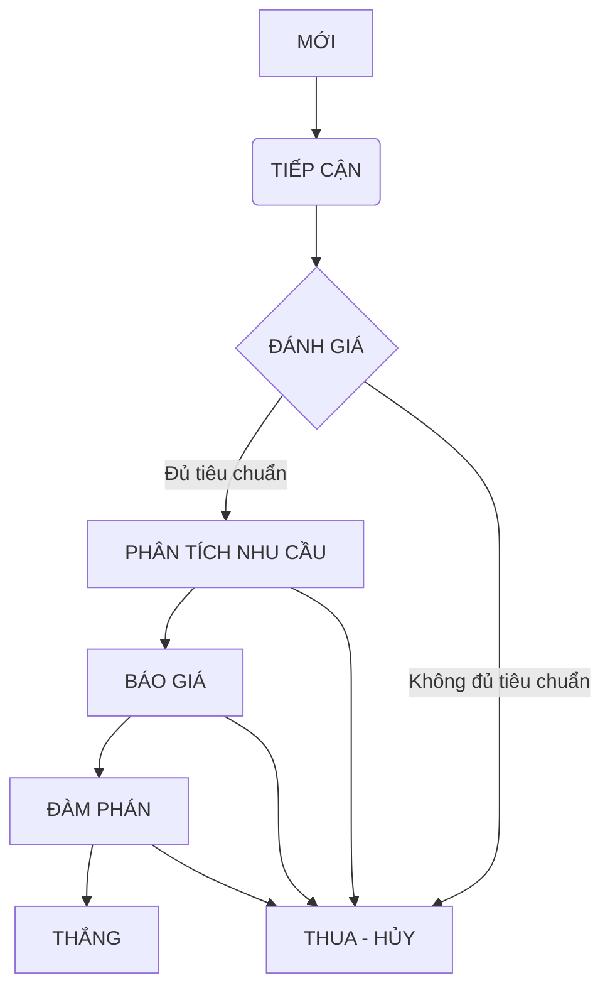

<Frame>
  ```mermaid [expandable]
  graph TD
      A[Bắt đầu: Hiểu Vấn đề KD & JTBD] --> B{Quy trình RÕ RÀNG & PHỨC TẠP?};
      B -- Có --> C[Ưu tiên: VẼ QUY TRÌNH Trước];
      B -- Không/Chưa rõ --> D[Ưu tiên: XÁC ĐỊNH ĐỐI TƯỢNG Trước];
  
      C --> E{Quy trình cần quản lý THỰC THỂ DỮ LIỆU nào?};
      E --> F[Định nghĩa LOẠI VIỆC và Trường];
      F --> G[Chi tiết hóa LUỒNG TIẾN TRÌNH cho Loại việc];
  
      D --> H{Thực thể này có các GIAI ĐOẠN XỬ LÝ?};
      H -- Có --> G;
      H -- Chưa rõ --> I[Phân tích thêm quy trình liên quan];
      I --> G;
  
      G --> J{Đối tượng có VÒNG ĐỜI & THUỘC TÍNH RIÊNG?};
      J -- Có --> K[Giữ/Tạo LOẠI VIỆC riêng];
      J -- Không --> L[Cân nhắc GỘP hoặc chỉ là TRƯỜNG];
  
      K --> M{Quy trình gắn với TRẠNG THÁI của ĐỐI TƯỢNG?};
      M -- Có --> N[Đây là LUỒNG TIẾN TRÌNH của Loại việc];
      M -- Không --> O[Cân nhắc LOẠI VIỆC 'QUY TRÌNH' riêng];
  
      N --> P[Hoàn thiện: Tự động hóa, Phân quyền, UI];
      O --> P;
      L --> P;
  ```
</Frame>

Tuyệt vời\! Đây chính là bản "kim chỉ nam" mà đội ngũ kinh doanh cần để tiếp cận Dmobin một cách chiến lược và hiệu quả nhất. Nó thể hiện sự chuẩn bị kỹ lưỡng, thấu hiểu sâu sắc khách hàng và tập trung vào việc mang lại giá trị thực sự.

Dưới đây là bản tài liệu hoàn chỉnh, giữ nguyên cấu trúc và nội dung chi tiết như Anh/Chị đã cung cấp:

---

## Phân Tích Nghiệp Vụ & Kế Hoạch Tiếp Cận Khách Hàng Dmobin (Trước Demo)

**Khách hàng:** Công ty TNHH Dmobin

**Lĩnh vực:** Phát triển Game & Ứng dụng Di động

**Người thực hiện:** Luklak Solution Engineer AI Agent

**Mục tiêu:** Chuẩn bị cho buổi demo thành công, chốt hợp đồng và xây dựng quan hệ đối tác lâu dài.

---

### I. Thấu Hiểu Khách Hàng Chuyên Sâu (CONTEXT UNDERSTANDING)

#### A. Bản Chất Doanh Nghiệp & Thị Trường:

\*   Dmobin là một studio phát triển game/app di động thành lập năm 2019, đã có những thành công nhất định với các sản phẩm top downloads (Survival 456, Red Ball 5, Fruit Ice Cream). Điều này cho thấy họ có năng lực sản xuất và hiểu biết thị trường.

\*   Ngành game/app di động cực kỳ cạnh tranh, đòi hỏi sự đổi mới liên tục, tốc độ ra mắt sản phẩm nhanh ("ra mắt nhanh – tinh gọn") và khả năng tối ưu hóa trải nghiệm người dùng để duy trì vị thế.

\*   Mục tiêu "phát triển quy mô công ty công nghệ toàn cầu" cho thấy tham vọng lớn và nhu cầu về một nền tảng vận hành có khả năng mở rộng, chuyên nghiệp.

#### B. Mô Hình Tổ Chức & Văn Hóa Làm Việc:

\*   **Quy mô:** \>80 nhân sự (20 full-time cốt lõi, 80 part-time linh hoạt). Đây là mô hình đòi hỏi sự quản lý nguồn lực thông minh, đặc biệt là phân công và theo dõi hiệu suất của nhân sự dự án part-time.

\*   **Cấu trúc:** Squad đa chức năng (Dev, QA, Art, PM, BA…). Đây là một lợi thế lớn vì họ đã quen với việc làm việc nhóm tự chủ, liên chức năng.

\*   **Phương pháp:** Agile – Scrum – OKR. Họ đã thấm nhuần tư duy Agile và định hướng kết quả. Đây là điểm tương đồng lớn với triết lý của Luklak.

\*   **Văn hóa (suy luận từ FIRES, 3P):** Dmobin chú trọng đến phát triển con người, không chỉ là hiệu suất công việc. FIRES (Focus, Integrity, Respect, Excellence, Speed/Simplicity - _cần xác nhận lại các giá trị này nếu có thể_) và 3P (Vị trí – Năng lực – Hiệu suất) cho thấy một văn hóa có đầu tư vào sự phát triển bền vững của nhân sự.

#### C. Hiện Trạng Công Nghệ & "Nỗi Đau":

\*   **Công cụ hiện tại:** ClickUp (quản lý công việc), Google Sheet (có thể cho theo dõi tổng thể, báo cáo), Misa Amis (kế toán, tài sản, có thể cả quản lý công việc).

\*   **Vấn đề cốt lõi:**

    \*   **Phân mảnh & Thiếu liên thông:** "Muốn chuyển toàn bộ vận hành sang hệ thống ERP tích hợp – đồng bộ." Đây là nỗi đau lớn nhất. Dữ liệu bị cô lập giữa ClickUp, các module Misa khác nhau, và Google Sheet.

    \*   **Chi phí cao & Phức tạp:** "Amis dùng khá ổn nhưng phải mua nhiều phần mềm khác nhau, chi phí khá cao."

    \*   **Khó mở rộng:** Các công cụ rời rạc sẽ cản trở mục tiêu phát triển toàn cầu.

    \*   **Thiếu đo lường hiệu quả toàn diện:** Khó khăn khi "đo lường hiệu quả làm việc của cá nhân, squad, sản phẩm" một cách nhất quán và tự động.

---

### II. Giải Mã Nhu Cầu & "Công Việc Cần Hoàn Thành" Của Dmobin

Dmobin không chỉ tìm kiếm một "phần mềm ERP". Họ đang tìm kiếm một **giải pháp chiến lược** để:

1.  **Hợp nhất vận hành:** Có một "nguồn sự thật duy nhất" cho toàn bộ công ty.

2.  **Tăng tốc độ phát triển sản phẩm:** Quy trình tinh gọn hơn, thông tin luân chuyển nhanh hơn.

3.  **Nâng cao hiệu suất và sự minh bạch:** Đo lường được hiệu quả của từng cá nhân, Squad, sản phẩm và liên kết với OKR/KPI.

4.  **Quản lý vòng đời sản phẩm toàn diện:** Từ ý tưởng đến khi vận hành và tăng trưởng.

5.  **Phát triển nhân sự bền vững:** Hỗ trợ quản lý theo 3P, FIRES, và lộ trình phát triển.

6.  **Tối ưu hóa chi phí công nghệ:** Thay thế nhiều giải pháp rời rạc bằng một nền tảng hiệu quả hơn.

7.  **Xây dựng nền tảng cho tăng trưởng toàn cầu.**

---

### III. Đánh Giá Sự Phù Hợp Của Luklak & Chiến Lược Định Vị

#### A. Điểm Mạnh Vượt Trội Của Luklak Cho Dmobin:

1.  **Nền Tảng Hợp Nhất & Phổ Quát (Unified & Universal):** Đây là **điểm chạm mạnh nhất** với nỗi đau "phân mảnh" của Dmobin. Luklak được thiết kế để trở thành hệ điều hành trung tâm, kết nối mọi nghiệp vụ.

    \*   **Nhấn mạnh:** Khả năng tùy chỉnh `Chức Năng` (Function) để tạo ra các phân hệ chuyên biệt (Work Management, Product Lifecycle, HRM (bao gồm Chấm công), Finance) nhưng tất cả đều "sống" trên cùng một nền tảng, dùng chung `Đối Tượng Phổ Quát` (Universal Object) và logic.

2.  **No-code/Low-code & Khả Năng Tùy Chỉnh Sâu Sắc:**

    \*   **Nhấn mạnh:** Dmobin có thể "tự may đo" các quy trình đặc thù của ngành game (vốn thay đổi rất nhanh) mà không phụ thuộc vào nhà cung cấp. Điều này giải quyết yêu cầu "SaaS cho phép tùy chỉnh sâu" và "Hỗ trợ tùy biến theo chiến lược dài hạn."

3.  **Tương Thích Hoàn Hảo Với Agile, Scrum, OKR:**

    \*   **Nhấn mạnh:** Luklak không áp đặt một quy trình cứng nhắc. Các `Mảng Việc` (Space) có thể được thiết kế để hỗ trợ hoàn hảo cho các Squad Scrum, với bảng Kanban, quản lý Sprint, Backlog. `Đầu Việc` (Object) có thể dễ dàng liên kết với OKR/KPI.

4.  **Tự Động Hóa Phổ Quát (Universal Automation):**

    \*   **Nhấn mạnh:** Khả năng tự động hóa luồng công việc xuyên suốt các phòng ban (VD: Ý tưởng sản phẩm mới → Tạo dự án cho Squad → Phân công task → Ghi nhận chi phí). Giải quyết nhu cầu "Tự động hoá luồng thanh toán", gửi thư mời/hủy trong tuyển dụng.

5.  **Quản Lý Vòng Đời Sản Phẩm Toàn Diện:**

    \*   **Nhấn mạnh:** Thiết kế một `Chức Năng` "Quản Lý Sản Phẩm" với `Loại Việc` "Sản Phẩm Game/App". Mỗi `Đầu Việc Sản Phẩm` sẽ có `Luồng Tiến Trình` từ Idea → MVP → Release → Scaling, liên kết với Squad, chi phí, doanh thu, bug, feedback.

6.  **HRM Linh Hoạt & Tùy Biến (Nay đã bao gồm Chấm công):**

    \*   **Nhấn mạnh:** Khả năng tạo các `Loại Việc` và `Trường Dữ Liệu` để quản lý Tuyển dụng (pipeline ứng viên, đánh giá FIRES), Onboarding (checklist tự động), Hồ sơ nhân viên (3P, hợp đồng), **Chấm công (với quy tắc linh hoạt, GPS, Wifi, IP, Livephoto)**, Nghỉ phép, Đánh giá (KPI/OKR, 360 theo FIRES), Lộ trình phát triển.

7.  **API Mở & Khả Năng Tích Hợp:**

    \*   **Nhấn mạnh:** Đáp ứng yêu cầu kết nối với Firebase, Payment Gateway, Google Sheet, Looker Studio, BigQuery. Dữ liệu từ Luklak có thể trở thành nguồn đầu vào cho các hệ thống phân tích chuyên sâu.

8.  **Giao Diện Hiện Đại & Trải Nghiệm Di Động Tốt:**

    \*   **Nhấn mạnh:** Phù hợp với một công ty công nghệ trẻ trung, năng động. Đặc biệt quan trọng cho đội ngũ part-time hoặc khi cần truy cập nhanh, bao gồm cả việc chấm công trên di động.

#### B. Xử Lý Các Khoảng Trống/Thách Thức Một Cách Khéo Léo:

1.  **Gantt Chart & Dependencies Phức Tạp:**

    \*   **Thừa nhận & Định vị:** "Chúng tôi hiểu rằng trong quản lý dự án truyền thống, Gantt chart với các phụ thuộc phức tạp là công cụ quen thuộc. Luklak, với triết lý Agile, tập trung vào sự linh hoạt và trực quan hóa luồng công việc qua Kanban và Lịch. Việc theo dõi phụ thuộc có thể được thực hiện bằng cách liên kết các `Đầu Việc Task` hoặc sử dụng `Trường chọn Đầu việc`. Đối với các dự án game/app có tính bất định cao, khả năng thích ứng nhanh của Scrum và sự minh bạch trên Kanban thường mang lại hiệu quả cao hơn một kế hoạch Gantt cứng nhắc. Chúng tôi tin rằng việc tập trung vào hoàn thành Sprint và đạt OKR sẽ là thước đo thành công quan trọng."

2.  **Time-tracking Chi Tiết (Theo Giờ trên Task):**

    \*   **Thừa nhận & Định vị:** "Tính năng Chấm công của Luklak hiện tại tập trung vào việc ghi nhận thời gian làm việc tổng thể (vào/ra ca) và quản lý sự hiện diện. Đối với việc log thời gian chi tiết cho từng task cụ thể, hệ thống cho phép quản lý thời gian ước tính và thời gian thực tế hoàn thành `Đầu Việc Task` qua các `Trường Dữ Liệu` (nhân viên tự nhập). Với văn hóa tập trung vào kết quả (OKR) của Dmobin, việc đo lường sự hoàn thành mục tiêu và tiến độ Sprint có thể quan trọng hơn là log từng giờ làm việc chi tiết trên task. Nếu Dmobin có nhu cầu time-tracking rất chi tiết cho mục đích tính chi phí dự án hoặc thanh toán freelancer theo giờ làm việc cụ thể trên task, chúng ta có thể thảo luận về các giải pháp tích hợp qua API với công cụ chuyên dụng."

3.  **Biểu Đồ Burndown (Burndown Charts):**

    \*   **Thừa nhận & Định vị:** "Tương tự như Gantt chart, biểu đồ Burndown là một công cụ hữu ích trong Scrum truyền thống. Luklak cung cấp dữ liệu nền tảng về trạng thái hoàn thành của các `Đầu Việc Task` trong Sprint. Từ dữ liệu này, Dmobin hoàn toàn có thể dễ dàng xuất ra (CSV) hoặc sử dụng API của Luklak để kết nối với Google Sheet, Looker Studio và tự xây dựng các biểu đồ Burndown tùy chỉnh theo đúng cách Anh/Chị muốn phân tích và trực quan hóa." Nhấn mạnh Luklak là _nguồn dữ liệu_ cho báo cáo đó.

4.  **Chấm Công "Tự Động Hoàn Toàn" (VD: Tích hợp máy chấm công vật lý):**

    \*   **Thừa nhận & Định vị:** "Tính năng Chấm công của Luklak rất mạnh mẽ với các tùy chọn GPS, Wifi, IP, Livephoto, phù hợp cho cả nhân viên làm việc tại văn phòng và từ xa, đặc biệt hữu ích cho đội ngũ part-time linh hoạt của Anh/Chị. Đối với việc tích hợp trực tiếp với máy chấm công vật lý để lấy dữ liệu tự động hoàn toàn, đây là một yêu cầu chuyên sâu. Luklak có thể đóng vai trò là nơi tổng hợp dữ liệu chấm công (nếu được đẩy vào qua API từ hệ thống máy chấm công) để liên kết với tính lương hoặc đánh giá hiệu suất."

5.  **Xuất Báo Cáo Chuẩn Thuế (Tích hợp với Misa):**

    \*   **Thừa nhận & Định vị:** "Chúng tôi hiểu Misa Amis đang là công cụ kế toán chính của Anh/Chị. Luklak sẽ không thay thế hoàn toàn vai trò của một phần mềm kế toán chuyên dụng cho các nghiệp vụ thuế phức tạp. Thay vào đó, Luklak sẽ trở thành trái tim vận hành, nơi mọi chi phí, doanh thu, thông tin hợp đồng, lương thưởng (dựa trên dữ liệu chấm công và hiệu suất từ Luklak) được ghi nhận và quản lý một cách tập trung, liên thông. Dữ liệu tài chính từ Luklak sẽ cực kỳ sạch sẽ và có cấu trúc, sẵn sàng để xuất ra (CSV) hoặc tích hợp qua API, đẩy vào Misa Amis (hoặc phần mềm kế toán khác) một cách dễ dàng, giúp bộ phận kế toán giảm thiểu tối đa việc nhập liệu thủ công và đảm bảo tính chính xác cho báo cáo thuế." **Nhấn mạnh Luklak là nguồn cấp dữ liệu đầu vào chất lượng cao cho hệ thống kế toán.**

---

### IV. Kế Hoạch Tiếp Cận & Demo Chiến Lược Cho Dmobin

**Thông Điệp Chủ Đạo:** "Luklak là Nền Tảng Vận Hành Hợp Nhất, được thiết kế riêng để Dmobin Tăng Tốc Sáng Tạo, Tối Ưu Hiệu Suất và Tự Tin Vươn Ra Toàn Cầu – Tất cả trên một hệ thống duy nhất, thay thế sự phức tạp và chi phí của nhiều công cụ rời rạc."

1.  **Mở Đầu (Đồng Cảm & Khơi Gợi):**

    \*   Bắt đầu bằng việc thể hiện sự am hiểu sâu sắc về ngành game/app, mô hình Agile/Squad/OKR của Dmobin.

    \*   Nhắc lại những thành tựu của Dmobin và tầm nhìn phát triển toàn cầu.

    \*   Chỉ ra "nỗi đau" chung của các công ty đang phát triển nhanh: sự phân mảnh dữ liệu, quy trình thiếu liên thông khi dùng nhiều công cụ, và chi phí leo thang.

2.  **Trình Bày Giải Pháp Tổng Thể Luklak (Bức Tranh Lớn):**

    _Giới thiệu Luklak không chỉ là một phần mềm, mà là một _   \*Nền Tảng Vận Hành Doanh Nghiệp Hợp Nhất\*\*.

    \*   Minh họa cấu trúc `Tổ Chức` → `Khu Vực` → `Mảng Việc` (tạo từ `Chức Năng`) sẽ được áp dụng cho Dmobin như thế nào, giúp họ hình dung được toàn bộ công ty nằm gọn trong một hệ thống.

    \*   **Demo trực quan:** Cho xem giao diện tổng thể, cách các Khu Vực/Mảng Việc được sắp xếp.

3.  **Đi Sâu Vào Các "Use Case" Then Chốt (Giải Quyết Nỗi Đau Cụ Thể):**

    \*   **Use Case 1: Từ Ý Tưởng Sản Phẩm Đến Tay Người Dùng – Quản Lý Vòng Đời Sản Phẩm & Dự Án Hợp Nhất.**

        \*   **Nỗi đau giải quyết:** Theo dõi rời rạc, khó liên kết ý tưởng với triển khai và kết quả.

        \*   **Demo Luklak:**

            \*   Tạo một `Đầu Việc Sản Phẩm Game` mới (VD: "Siêu Anh Hùng Bắn Ruồi").

            \*   Gán các `Trường Dữ Liệu` quan trọng: OKR mục tiêu, ngày release dự kiến, thể loại game.

            \*   Liên kết `Đầu Việc Sản Phẩm` này với một `Mảng Việc` của Squad A.

            \*   Trong `Mảng Việc` của Squad A, tạo các `Đầu Việc Epic` ("Thiết kế Nhân vật", "Xây dựng Level 1"), rồi các `Đầu Việc Task` con cho Sprint 1 (VD: "Vẽ concept nhân vật X", "Code logic di chuyển cơ bản").

            \*   Cho thấy cách `Livechat` ngay trên `Đầu Việc Task` giúp team trao đổi.

            \*   **Báo cáo hoàn thành công việc bằng hình ảnh:** Demo việc đính kèm file thiết kế, video gameplay test vào `Đầu Việc Task` và cách PM review.

            \*   Liên kết `Đầu Việc Sản Phẩm` với `Đầu Việc Chi Phí` (từ Mảng Việc Tài Chính) và `Đầu Việc KPI Doanh Thu` (từ Mảng Việc BI/Marketing).

    \*   **Use Case 2: Quy Trình Phê Duyệt Mua Tài Sản Game (Artwork, Sound) – Tự Động Hóa & Minh Bạch.**

        \*   **Nỗi đau giải quyết:** Quy trình phê duyệt thủ công, chậm trễ, thiếu minh bạch.

        \*   **Demo Luklak:**

            \*   Artist tạo một `Đầu Việc Yêu Cầu Mua Hàng` ("Mua bộ Animation 3D cho nhân vật X").

            \*   `Luồng Tiến Trình`: Yêu cầu mới → Art Lead Duyệt → PM Duyệt → Tài Chính Duyệt → Đã Mua.

            \*   **Tự Động Hóa:** Khi Artist chuyển trạng thái sang "Chờ Art Lead Duyệt", Art Lead nhận thông báo. Khi Art Lead duyệt, PM nhận thông báo...

            \*   Mọi lịch sử duyệt, bình luận đều được lưu lại trên `Đầu Việc`.

    \*   **Use Case 3: Quản Lý Nhân Sự & Chấm Công Linh Hoạt (Đặc biệt cho Part-time).**

        \*   **Nỗi đau giải quyết:** Khó theo dõi và phân công cho nhân sự không cố định, quản lý chấm công phức tạp.

        \*   **Demo Luklak:**

            \*   Giới thiệu tính năng Chấm công: Thiết lập `Quy tắc chấm công` riêng cho nhóm Part-time (VD: theo ca, theo dự án, có thể yêu cầu Livephoto).

            \*   Nhân viên Part-time thực hiện chấm công trên mobile.

            \*   Quản lý xem báo cáo chấm công, lọc theo Squad hoặc dự án.

            \*   Liên kết dữ liệu chấm công với `Đầu Việc Task` (thông qua Người được giao) và `Đầu Việc Tính Lương` (trong Mảng Việc Tài Chính).

    \*   **Use Case 4 (Ngắn gọn): Onboarding Nhân Viên Mới Theo Quy Trình FIRES.**

        \*   **Nỗi đau giải quyết:** Quy trình onboarding chưa chuẩn hóa.

        \*   **Demo Luklak:** Khi một `Đầu Việc Nhân Viên Mới` được tạo và chuyển trạng thái "Đã Nhận Việc", hệ thống **Tự Động Hóa** tạo ra một loạt các `Đầu Việc Onboarding` con (đọc tài liệu FIRES, gặp mentor, hoàn thành bài test văn hóa...) được gán cho nhân viên mới và người hỗ trợ.

4.  **Giải Quyết Các "Khoảng Trống" Một Cách Thẳng Thắn & Đưa Ra Giải Pháp:**

    \*   Sử dụng cách định vị đã nêu ở mục III.B. Luôn nhấn mạnh vào giải pháp tổng thể và khả năng tích hợp của Luklak.

5.  **Trải Nghiệm Giao Diện & Tính Dễ Dùng:**

    \*   Cho khách hàng tự thao tác một vài bước đơn giản trên giao diện (nếu là demo trực tiếp) để cảm nhận sự mượt mà, hiện đại và dễ dùng trên mobile.

6.  **Nhấn Mạnh Lợi Thế Cạnh Tranh Của Luklak:**

    \*   **Hợp nhất thực sự:** So sánh với việc phải "nhảy" giữa ClickUp, Google Sheet, và nhiều module Misa.

    \*   **Tùy chỉnh không giới hạn:** Cho phép Dmobin xây dựng chính xác những gì họ cần.

    \*   **Tối ưu chi phí dài hạn:** Một nền tảng thay cho nhiều công cụ.

    \*   **Đối tác đồng hành chiến lược:** Khẳng định Luklak không chỉ bán phần mềm mà còn tư vấn và hỗ trợ Dmobin xây dựng hệ thống vận hành tối ưu.

7.  **Tóm Tắt Giá Trị & Kêu Gọi Hành Động:**

    \*   Tóm tắt lại Luklak sẽ giúp Dmobin giải quyết các vấn đề cốt lõi và đạt được mục tiêu như thế nào (Hợp nhất, Tăng tốc, Minh bạch, Phát triển nhân sự, Tối ưu chi phí, Nền tảng toàn cầu).

    \*   Đề xuất các bước tiếp theo rõ ràng: Workshop chi tiết hóa quy trình, lên kế hoạch triển khai theo giai đoạn, báo giá chính thức.

**Phong Cách Demo:**

\*   **Tự tin & Chuyên nghiệp:** Thể hiện sự am hiểu sâu sắc về cả Luklak và ngành của khách hàng.

\*   **Tư vấn & Đồng hành:** Không chỉ giới thiệu tính năng, mà là cùng khách hàng xây dựng giải pháp.

\*   **Tập trung vào lợi ích, không chỉ tính năng:** Luôn trả lời câu hỏi "Điều này giúp gì cho Dmobin?"

\*   **Trực quan & Sinh động:** Sử dụng tối đa giao diện Luklak, hạn chế slide.

\*   **Lắng nghe & Tương tác:** Khuyến khích câu hỏi và thảo luận.

Bằng cách tiếp cận này, đội ngũ kinh doanh của Luklak sẽ không chỉ giới thiệu một sản phẩm, mà còn trình bày một giải pháp chiến lược, toàn diện, khơi gợi sự tin tưởng và mong muốn hợp tác từ Dmobin. Việc bổ sung tính năng Chấm công càng làm tăng thêm giá trị và sự phù hợp của Luklak đối với các nhu cầu cụ thể của họ.