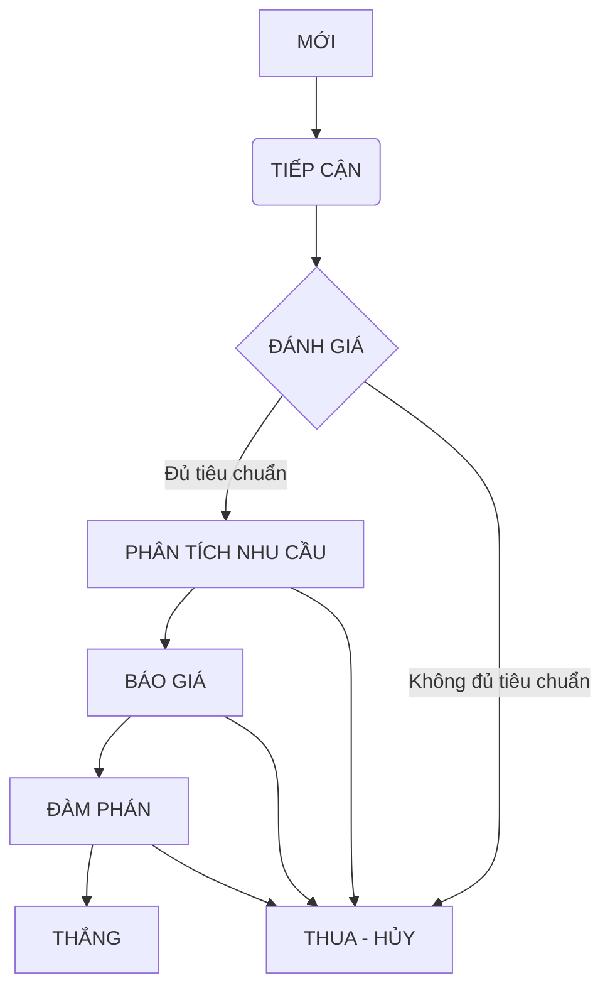

<iframe width="100%" height="500px" style={{ boxShadow:"0 2px 8px 0 rgba(63,69,81,0.16)",borderRadius:"15px" }} allowtransparency="true" allowfullscreen="true" scrolling="no" title="Embedded DrawSQL IFrame" frameborder="0" src="https://drawsql.app/teams/a-2035/diagrams/quanlithuchi/embed" />

import MySnippet from '/snippets/path/to/my-snippet.mdx';

## Header

Lorem impsum dolor sit amet.

<MySnippet/>