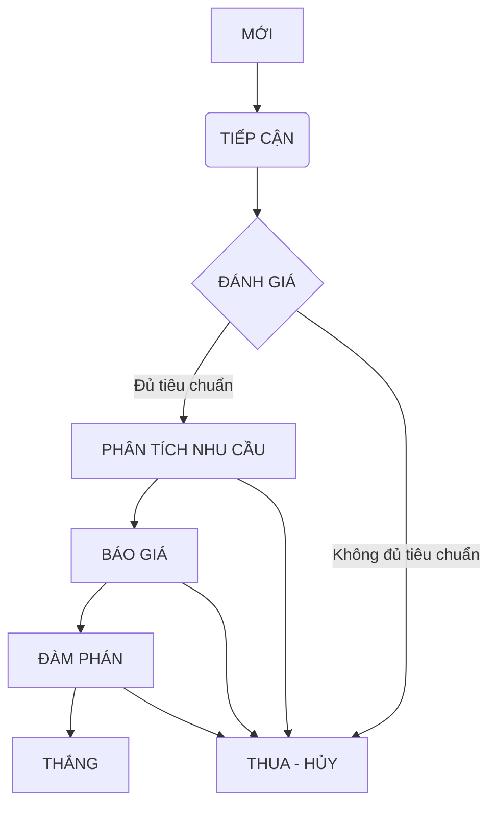

```mermaid
    graph TD
    A[Bắt đầu: Hiểu Vấn đề KD & JTBD] --> B{Quy trình RÕ RÀNG & PHỨC TẠP?};
    B -- Có --> C[Ưu tiên: VẼ QUY TRÌNH Trước];
    B -- Không/Chưa rõ --> D[Ưu tiên: XÁC ĐỊNH ĐỐI TƯỢNG Trước];

    C --> E{Quy trình cần quản lý THỰC THỂ DỮ LIỆU nào?};
    E --> F[Định nghĩa LOẠI VIỆC (Objects) & Trường];
    F --> G[Chi tiết hóa LUỒNG TIẾN TRÌNH cho Loại việc];

    D --> H{Thực thể này có các GIAI ĐOẠN XỬ LÝ?};
    H -- Có --> G;
    H -- Chưa rõ --> I[Phân tích thêm quy trình liên quan];
    I --> G;

    G --> J{Đối tượng này có VÒNG ĐỜI & THUỘC TÍNH RIÊNG biệt không?};
    J -- Có --> K[Giữ/Tạo LOẠI VIỆC riêng];
    J -- Không --> L[Cân nhắc GỘP hoặc chỉ là TRƯỜNG];

    K --> M{Quy trình gắn với TRẠNG THÁI của ĐỐI TƯỢNG này?};
    M -- Có --> N[Đây là LUỒNG TIẾN TRÌNH của Loại việc];
    M -- Không --> O[Cân nhắc LOẠI VIỆC 'QUY TRÌNH' riêng];

    N --> P[Hoàn thiện: Tự động hóa, Phân quyền, UI];
    O --> P;
    L --> P;
```

<Frame>
  ```mermaid
  graph TD
      A[Bắt đầu: Hiểu Vấn đề KD & JTBD] --> B{Quy trình RÕ RÀNG & PHỨC TẠP?};
      B -- Có --> C[Ưu tiên: VẼ QUY TRÌNH Trước];
      B -- Không/Chưa rõ --> D[Ưu tiên: XÁC ĐỊNH ĐỐI TƯỢNG Trước];
  
      C --> E{Quy trình cần quản lý THỰC THỂ DỮ LIỆU nào?};
      E --> F[Định nghĩa LOẠI VIỆC (Objects) & Trường];
      F --> G[Chi tiết hóa LUỒNG TIẾN TRÌNH cho Loại việc];
  
      D --> H{Thực thể này có các GIAI ĐOẠN XỬ LÝ?};
      H -- Có --> G;
      H -- Chưa rõ --> I[Phân tích thêm quy trình liên quan];
      I --> G;
  
      G --> J{Đối tượng này có VÒNG ĐỜI & THUỘC TÍNH RIÊNG biệt không?};
      J -- Có --> K[Giữ/Tạo LOẠI VIỆC riêng];
      J -- Không --> L[Cân nhắc GỘP hoặc chỉ là TRƯỜNG];
  
      K --> M{Quy trình gắn với TRẠNG THÁI của ĐỐI TƯỢNG này?};
      M -- Có --> N[Đây là LUỒNG TIẾN TRÌNH của Loại việc];
      M -- Không --> O[Cân nhắc LOẠI VIỆC 'QUY TRÌNH' riêng];
  
      N --> P[Hoàn thiện: Tự động hóa, Phân quyền, UI];
      O --> P;
      L --> P;
  ```
</Frame>

<iframe width="100%" height="500px" style={{ boxShadow:"0 2px 8px 0 rgba(63,69,81,0.16)",borderRadius:"15px" }} allowtransparency="true" allowfullscreen="true" scrolling="no" title="Embedded DrawSQL IFrame" frameborder="0" src="https://drawsql.app/teams/a-2035/diagrams/quanlithuchi/embed" />

import MySnippet from '/snippets/path/to/my-snippet.mdx';

## Header

Lorem impsum dolor sit amet.

<MySnippet />