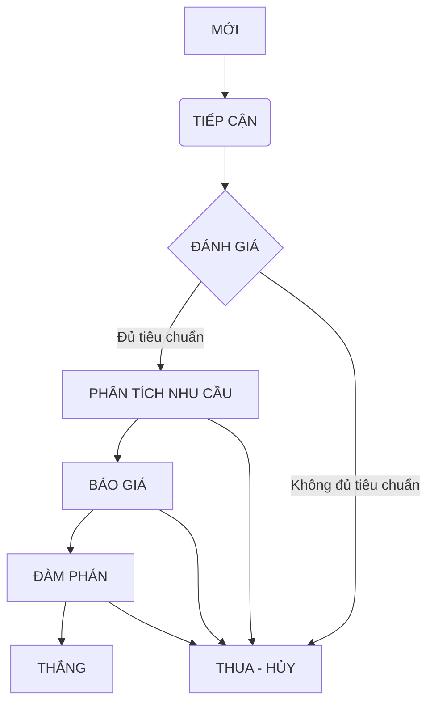
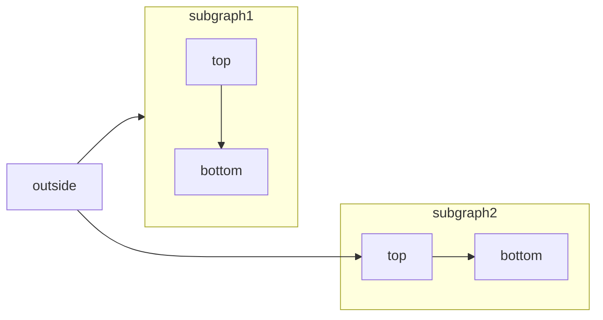

```mermaid
graph TD
    A[MỚI] --> B(TIẾP CẬN);
    B --> C{ĐÁNH GIÁ};
    C -- Đủ tiêu chuẩn --> D[PHÂN TÍCH NHU CẦU];
    C -- Không đủ tiêu chuẩn --> H[THUA - HỦY];
    D --> E[BÁO GIÁ];
    E --> F[ĐÀM PHÁN];
    F --> G[THẮNG];
    F --> H;
    E --> H;
    D --> H;
```

```mermaid
  flowchart LR
    subgraph subgraph1
        direction TB
        top1[top] --> bottom1[bottom]
    end
    subgraph subgraph2
        direction TB
        top2[top] --> bottom2[bottom]
    end
    %% ^ These subgraphs are identical, except for the links to them:

    %% Link *to* subgraph1: subgraph1 direction is maintained
    outside --> subgraph1
    %% Link *within* subgraph2:
    %% subgraph2 inherits the direction of the top-level graph (LR)
    outside ---> top2
```