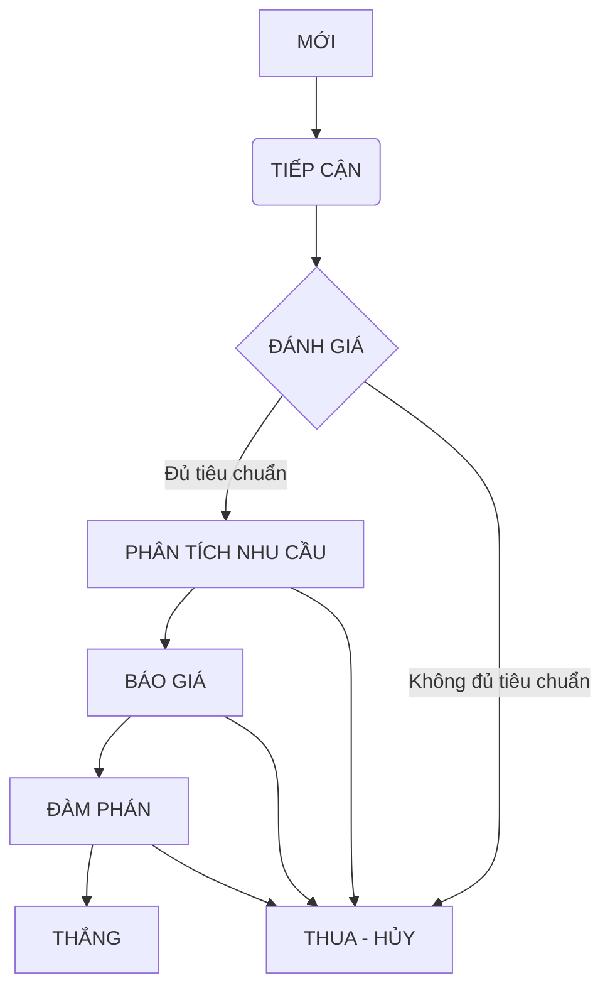

<Frame>
  ```mermaid
  graph TD
      A[Bắt đầu: Hiểu Vấn đề Kinh doanh & JTBD] --> B{Quy trình có RÕ RÀNG & PHỨC TẠP không?};
      B -- Có --> C[Bắt đầu bằng việc VẼ BẢN ĐỒ QUY TRÌNH (Workflow-First Leaning)];
      B -- Không/Chưa rõ --> D[Bắt đầu bằng việc XÁC ĐỊNH CÁC THỰC THỂ DỮ LIỆU CỐT LÕI (Object-First Leaning)];
  
      C --> E{Trong quy trình, có những THỰC THỂ DỮ LIỆU nào cần quản lý?};
      E -- Có --> F[Định nghĩa các LOẠI VIỆC (Objects) và Trường Dữ liệu];
      F --> G[Chi tiết hóa LUỒNG TIẾN TRÌNH cho từng Loại việc];
  
      D --> H{Các Thực thể này trải qua NHỮNG GIAI ĐOẠN nào?};
      H -- Có --> G;
      H -- Chưa rõ --> I[Tiếp tục phân tích quy trình liên quan đến các Thực thể này];
      I --> G;
  
      G --> J{Đối tượng này có VÒNG ĐỜI & NHIỀU THUỘC TÍNH RIÊNG không?};
      J -- Có --> K[Giữ/Tạo thành LOẠI VIỆC riêng];
      J -- Không --> L[Xem xét GỘP vào Loại việc khác hoặc chỉ là TRƯỜNG DỮ LIỆU];
  
      K --> M{Quy trình này có GẮN LIỀN với sự thay đổi trạng thái của ĐỐI TƯỢNG này không?};
      M -- Có --> N[Đây là LUỒNG TIẾN TRÌNH bên trong Loại việc];
      M -- Không --> O[Xem xét tạo LOẠI VIỆC "QUY TRÌNH" riêng để quản lý nó];
  
      N --> P[Hoàn thiện: Tự động hóa, Phân quyền, Giao diện];
      O --> P;
      L --> P;
  ```

  Adjust the caption and image of your Frame component here.
</Frame>

<iframe width="100%" height="500px" style={{ boxShadow:"0 2px 8px 0 rgba(63,69,81,0.16)",borderRadius:"15px" }} allowtransparency="true" allowfullscreen="true" scrolling="no" title="Embedded DrawSQL IFrame" frameborder="0" src="https://drawsql.app/teams/a-2035/diagrams/quanlithuchi/embed" />

import MySnippet from '/snippets/path/to/my-snippet.mdx';

## Header

Lorem impsum dolor sit amet.

<MySnippet />