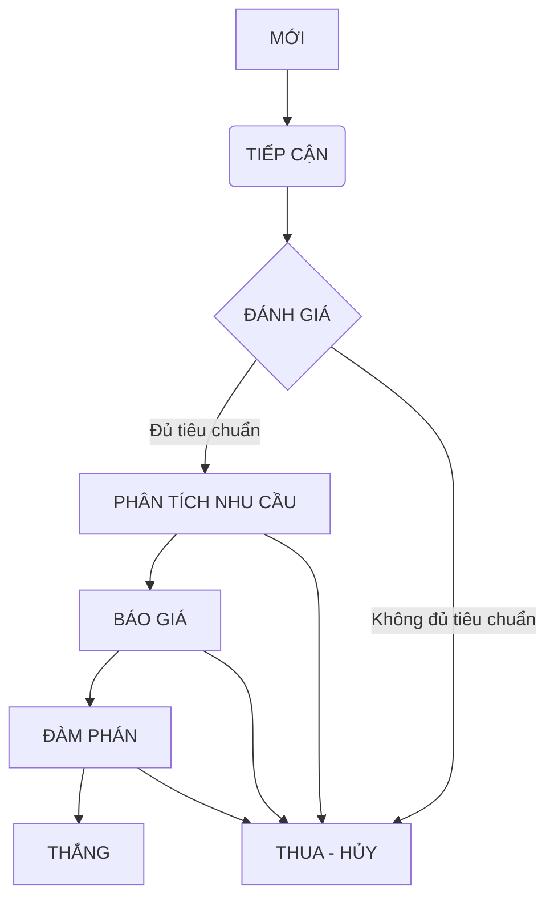

```mermaid
graph TD
    A[MỚI] --> B(TIẾP CẬN);
    B --> C{ĐÁNH GIÁ};
    C -- Đủ tiêu chuẩn --> D[PHÂN TÍCH NHU CẦU];
    C -- Không đủ tiêu chuẩn --> H[THUA - HỦY];
    D --> E[BÁO GIÁ];
    E --> F[ĐÀM PHÁN];
    F --> G[THẮNG];
    F --> H;
    E --> H;
    D --> H;
```