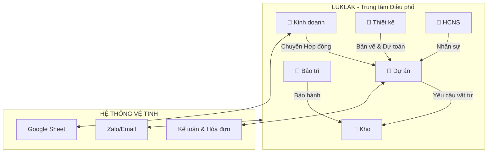

**1. Tóm tắt hiện trạng & Giải pháp**

Công ty Song Anh hiện đang đối mặt với các thách thức về quy trình phân tán và thiếu liên thông dữ liệu.

<Warning>
**Điểm đau (Pain Points)**
* Quy trình rời rạc giữa các phòng ban (Kinh doanh - Thiết kế - Dự án).
* Khó kiểm soát chi phí thực tế (Vật tư/Nhân công) so với Báo giá.
* Thiếu hệ thống báo cáo tập trung (Dashboard) cho Ban Giám đốc.
</Warning>

**Giải pháp:** Sử dụng **Luklak** làm trung tâm điều phối (Hub), kết nối `📂 Khu vực` nghiệp vụ với các hệ thống chuyên biệt (Kế toán, Kho) để tạo nên dòng chảy dữ liệu thông suốt.

---

**2. Kiến trúc Dòng chảy Dữ liệu**

Hệ thống được thiết kế theo mô hình **Hub & Spoke**, với Luklak là trung tâm xử lý `🧊 Đầu việc` (Object) và điều phối trạng thái.

---

**3. Bản đồ Quy hoạch Hệ thống**

Hệ thống được tổ chức thành 06 `📂 Khu vực` (Areas) chính, mỗi khu vực chứa các `⏹️ Mảng việc` (Spaces) chuyên biệt:

<CardGroup cols={2}>
<Card title="1. Khu vực Kinh doanh" icon="briefcase" href="https://www.google.com/search?q=./01-KHU-VUC-KINH-DOANH">
Quản lý dòng đời khách hàng từ cơ hội đến chốt đơn.
* `⏹️ Khách hàng &amp; Cơ hội`
* `⏹️ Khảo sát &amp; Báo giá`
</Card>
<Card title="2. Khu vực Thiết kế" icon="pen-ruler" href="./02-KHU-VUC-THIET-KE">
Sản xuất hồ sơ kỹ thuật và dự toán thi công.
* `⏹️ Thiết kế concept`
* `⏹️ Dự toán &amp; Bản vẽ`
</Card>
<Card title="3. Khu vực Dự án" icon="building-user" href="./03-KHU-VUC-DU-AN">
Trung tâm thực thi, giám sát tiến độ và nghiệm thu.
* `⏹️ Quản lý Hợp đồng`
* `⏹️ Thi công &amp; Nghiệm thu`
</Card>
<Card title="4. Khu vực Kho" icon="warehouse" href="./04-KHU-VUC-KHO">
Kiểm soát tài nguyên, vật tư và thiết bị.
* `⏹️ Nhập/Xuất kho`
* `⏹️ Máy móc &amp; Phương tiện`
</Card>
<Card title="5. Khu vực Bảo trì" icon="screwdriver-wrench" href="./05-KHU-VUC-BAO-TRI">
Chăm sóc khách hàng sau bán hàng và xử lý sự cố.
* `⏹️ Bảo trì định kỳ`
* `⏹️ Sự cố &amp; Sửa chữa`
</Card>
<Card title="6. Khu vực HCNS" icon="users" href="./06-KHU-VUC-HCNS">
Hậu phương vững chắc về nhân lực và chính sách.
* `⏹️ Tuyển dụng &amp; Hồ sơ`
* `⏹️ Chấm công &amp; Lương`
</Card>
</CardGroup>

---

**4. Tài liệu Bổ trợ**

Để vận hành trơn tru, vui lòng tham khảo các quy tắc liên thông và tích hợp:

<CardGroup cols={2}>
<Card title="Liên thông Khu vực" icon="network-wired" href="./07-LIEN-THONG-KHU-VUC">
Quy tắc chuyển giao `🧊 Đầu việc` giữa các phòng ban.
</Card>
<Card title="Tích hợp Hệ thống" icon="plug" href="./08-TICH-HOP-HE-THONG">
Cấu hình kết nối với Google Sheet và PMHT kế toán.
</Card>
</CardGroup>

**What's Next?**

* [Chi tiết Khu vực Kinh doanh](https://www.google.com/search?q=./01-KHU-VUC-KINH-DOANH)
* [Hướng dẫn sử dụng Luklak cơ bản](https://www.google.com/search?q=/01-getting-started/introduction)

