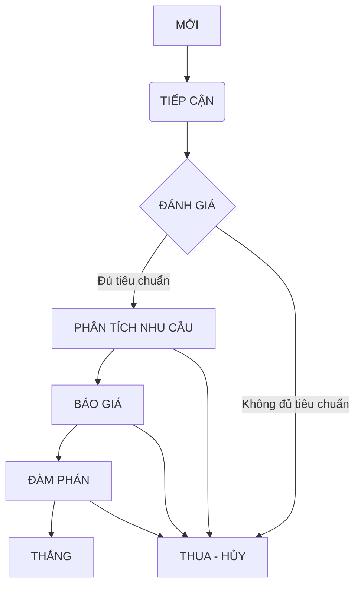

### 🚀 TỔNG QUAN

**Mục đích:** Quản lý toàn bộ quy trình bán hàng B2B, từ việc theo dõi các `Công ty`, `Người liên hệ`, quản lý các `Cơ hội kinh doanh`, cho đến việc tạo `Báo giá` và `Hợp đồng`.

**Logic nghiệp vụ:** Hệ thống xoay quanh các đối tượng chính: `Công ty` và `Cơ hội`. Một `Công ty` có thể có nhiều `Người liên hệ` và nhiều `Cơ hội`. Mỗi `Cơ hội` sẽ trải qua một quy trình bán hàng chuẩn hoá. Khi một `Cơ hội` thành công, một `Hợp đồng` sẽ được tạo ra. Các `Hoạt động` (cuộc gọi, email, cuộc họp) được ghi nhận và liên kết với các đối tượng trên để có cái nhìn 360 độ.

**Tác động kinh doanh:**
*   Trung tâm hóa dữ liệu khách hàng, tránh thất thoát thông tin.
*   Chuẩn hóa và tối ưu hóa quy trình bán hàng.
*   Tăng khả năng theo dõi hiệu suất của đội ngũ kinh doanh.
*   Cung cấp dữ liệu chính xác cho việc dự báo doanh thu.

**Tổng quan Loại việc & Luồng nghiệp vụ**

| Tên | Mô tả ngắn |
| :--- | :--- |
| **`Công ty` (Account)** | Quản lý thông tin pháp nhân của khách hàng B2B. |
| **`Người liên hệ` (Contact)** | Quản lý thông tin các cá nhân làm việc tại Công ty khách hàng. |
| **`Cơ hội` (Deal/Opportunity)** | Quản lý một thương vụ bán hàng tiềm năng với một Công ty. Đây là luồng nghiệp vụ cốt lõi. |
| **`Báo giá` (Quote)** | Quản lý các phiên bản báo giá gửi cho khách hàng trong một Cơ hội. |
| **`Hợp đồng` (Contract)** | Quản lý các hợp đồng được ký kết sau khi Cơ hội thành công. |
| **`Hoạt động` (Activity)** | Ghi nhận các tương tác với khách hàng (cuộc gọi, email, họp). |
| **`Sản phẩm/Dịch vụ`** | Danh mục các sản phẩm, dịch vụ mà doanh nghiệp cung cấp. |

**Tóm tắt kỹ thuật**
*   **7 loại việc chính**: `Công ty`, `Người liên hệ`, `Cơ hội`, `Báo giá`, `Hợp đồng`, `Hoạt động`, `Sản phẩm/Dịch vụ`.
*   **20+ trạng thái** quy trình từ tạo đến hoàn thành trên các loại việc.
*   **60+ trường dữ liệu** thu thập thông tin đầy đủ.
*   **5+ quy tắc tự động hóa** xử lý thông minh.
*   **Kết nối app ngoài**: Có thể kết nối với Email Server, Zalo.
*   **4+ giao diện làm việc**: Sales Pipeline (Kanban), Danh sách Công ty, Lịch Hoạt động, Dashboard tổng quan.
*   **5+ bộ lọc thông minh** với cảnh báo tự động.
*   **4+ khối trình bày báo cáo**: Biểu đồ phễu, Biểu đồ doanh số, Thống kê.
*   **3 vai trò** chuyên biệt cho chức năng này.

---

### 🧩 LOẠI VIỆC & NGHIỆP VỤ

#### DANH SÁCH LOẠI VIỆC

##### **1. `Cơ hội` (Deal/Opportunity)** - *Loại việc Tiêu chuẩn*

**Mô tả nghiệp vụ**
*   **Mô tả nghiệp vụ**: Đại diện cho một thương vụ bán hàng cụ thể với một khách hàng, có giá trị và ngày dự kiến kết thúc. Đây là đối tượng trung tâm của quy trình sales.
*   **Ví dụ**: Cơ hội cung cấp 100 license phần mềm cho Công ty ABC; Cơ hội triển khai hệ thống ERP cho Tập đoàn XYZ.

**Luồng tiến trình**

**Bảng chi tiết các Trạng thái**

| Trạng thái | Nghiệp vụ | Cài đặt nâng cao |
| :--- | :--- | :--- |
| **1. `MỚI`** | Cơ hội vừa được tạo, chờ nhân viên kinh doanh (NVKD) tiếp nhận. | **Phân quyền**: Chỉ NVKD được chuyển sang trạng thái tiếp theo. |
| **2. `TIẾP CẬN`** | NVKD đã liên hệ lần đầu với khách hàng. | **Điều kiện dữ liệu**: Yêu cầu cập nhật trường `Ngày liên hệ đầu tiên`. |
| **3. `ĐÁNH GIÁ`** | NVKD đánh giá tiềm năng của cơ hội (dựa trên ngân sách, nhu cầu, thẩm quyền). | **Màn hình nhập liệu**: Hiện các trường `Ngân sách dự kiến`, `Mức độ ưu tiên`. |
| **4. `PHÂN TÍCH NHU CẦU`** | NVKD làm việc sâu với khách hàng để hiểu rõ nhu cầu. | **Điều kiện dữ liệu**: Yêu cầu tạo ít nhất 1 `Hoạt động` loại `Cuộc họp`. |
| **5. `BÁO GIÁ`** | NVKD đã gửi báo giá cho khách hàng. | **Tự động hoá**: Tạo 1 `Việc con` loại `Báo giá` với trạng thái `Đã gửi`. |
| **6. `ĐÀM PHÁN`** | Hai bên đang thương lượng về các điều khoản trong báo giá/hợp đồng. | **Phân quyền**: Trưởng phòng Kinh doanh (TPKD) có thể tham gia và nhận thông báo. |
| **7. `THẮNG`** | Khách hàng đã đồng ý. Cơ hội thành công. | **Tự động hoá**: 1. Tự động tạo `Việc con` loại `Hợp đồng`. 2. Cập nhật trường `Loại hình` ở `Công ty` liên quan thành `Khách hàng`. |
| **8. `THUA - HỦY`** | Khách hàng từ chối hoặc cơ hội không khả thi. | **Màn hình nhập liệu**: Yêu cầu bắt buộc nhập `Lý do thua/hủy`. |

**Màn hình trường dữ liệu**

| Nhóm thông tin | Trường dữ liệu | Ghi chú |
| :--- | :--- | :--- |
| **Thông tin chung (4)** | `Tên cơ hội`, `Mô tả`, `Công ty`, `Người liên hệ chính` | Các thông tin cơ bản để định danh Cơ hội. |
| **Thông tin giá trị (4)** | `Giá trị dự kiến`, `Tỷ lệ thành công (%)`, `Doanh thu dự kiến (công thức)`, `Danh sách sản phẩm (Bảng dữ liệu)` | Các thông tin tài chính quan trọng để dự báo. |
| **Thông tin Phân loại (4)** | `Nguồn cơ hội`, `Giai đoạn bán hàng`, `Mức độ ưu tiên`, `Nhân viên phụ trách` | Các trường để phân loại và báo cáo. |
| **Thông tin thời gian (3)** | `Ngày tạo`, `Ngày dự kiến đóng`, `Ngày đóng thực tế` | Các mốc thời gian của cơ hội. |
| **Thông tin thất bại (2)** | `Lý do thua/hủy`, `Đối thủ cạnh tranh` | Thu thập dữ liệu khi cơ hội thất bại. |
| **Tổng số trường** | **17** | |

---
##### **2. `Công ty` (Account)** - *Loại việc Tiêu chuẩn*
*   **Mô tả nghiệp vụ**: Lưu trữ thông tin về một tổ chức là khách hàng hoặc khách hàng tiềm năng.
*   **Luồng tiến trình**: Đơn giản: `TIỀM NĂNG` → `KHÁCH HÀNG` → `NGỪNG HỢP TÁC`
*   **Màn hình dữ liệu**: `Tên công ty`, `Mã số thuế`, `Website`, `Địa chỉ`, `Ngành nghề`, `Quy mô`, `Loại hình` (Tiềm năng, Khách hàng), `Người phụ trách`. (Tổng: 8 trường)

---
##### **3. `Người liên hệ` (Contact)** - *Loại việc con của `Công ty`*
*   **Mô tả nghiệp vụ**: Lưu trữ thông tin về một cá nhân làm việc tại một Công ty.
*   **Luồng tiến trình**: `MỚI` → `ĐANG LIÊN HỆ` → `NGỪNG LIÊN HỆ`
*   **Màn hình dữ liệu**: `Họ và tên`, `Chức danh`, `Email`, `Số điện thoại`, `Công ty (tham chiếu cha)`, `Ghi chú`. (Tổng: 6 trường)

---
##### **4. `Báo giá` (Quote)** - *Loại việc con của `Cơ hội`*
*   **Mô tả nghiệp vụ**: Một tài liệu báo giá chính thức gửi cho khách hàng, bao gồm các sản phẩm, dịch vụ, số lượng, đơn giá và thành tiền.
*   **Luồng tiến trình**: `DỰ THẢO` → `CHỜ DUYỆT` → `ĐÃ GỬI` → `KHÁCH HÀNG CHẤP NHẬN` → `KHÁCH HÀNG TỪ CHỐI`
*   **Màn hình dữ liệu**: `Mã báo giá`, `Ngày báo giá`, `Ngày hết hạn`, `Bảng chi tiết sản phẩm (Bảng dữ liệu)`, `Tổng tiền trước thuế`, `Thuế VAT`, `Tổng tiền sau thuế`, `Điều khoản thanh toán`. (Tổng: 8 trường)

---
##### **5. `Hợp đồng` (Contract)** - *Loại việc con của `Cơ hội`*
*   **Mô tả nghiệp vụ**: Tài liệu pháp lý ghi nhận thỏa thuận giữa hai bên sau khi cơ hội thắng.
*   **Luồng tiến trình**: `DỰ THẢO` → `CHỜ KÝ` → `ĐÃ KÝ` → `ĐANG THỰC HIỆN` → `HOÀN THÀNH` → `THANH LÝ`
*   **Màn hình dữ liệu**: `Số hợp đồng`, `Tên hợp đồng`, `Ngày ký`, `Ngày hiệu lực`, `Ngày kết thúc`, `Giá trị hợp đồng`, `Trạng thái thanh toán`, `File đính kèm`. (Tổng: 8 trường)

---
##### **6. `Hoạt động` (Activity)** - *Loại việc Tiêu chuẩn*
*   **Mô tả nghiệp vụ**: Ghi nhận một tương tác cụ thể với khách hàng.
*   **Luồng tiến trình**: `SẮP DIỄN RA` → `ĐÃ HOÀN THÀNH` → `ĐÃ HỦY`
*   **Màn hình dữ liệu**: `Tiêu đề`, `Loại hoạt động` (Email, Gọi điện, Họp), `Thời gian bắt đầu`, `Thời gian kết thúc`, `Mô tả kết quả`, `Liên kết` (Kết nối với `Cơ hội`, `Công ty`, `Người liên hệ`). (Tổng: 6 trường)

---
##### **7. `Sản phẩm/Dịch vụ`** - *Loại việc Tiêu chuẩn*
*   **Mô tả nghiệp vụ**: Danh mục sản phẩm/dịch vụ của công ty để dùng trong Báo giá.
*   **Luồng tiến trình**: `ĐANG KINH DOANH` → `NGỪNG KINH DOANH`
*   **Màn hình dữ liệu**: `Tên sản phẩm`, `Mã sản phẩm`, `Đơn vị tính`, `Đơn giá`, `Mô tả`. (Tổng: 5 trường)

---
#### Mối quan hệ giữa các Loại việc

**Loại việc Cha - con**
| Quan hệ Cha - Con | Mô tả |
| :--- | :--- |
| `Công ty` - `Người liên hệ` | Một công ty có nhiều người liên hệ. |
| `Cơ hội` - `Báo giá` | Một cơ hội có thể có nhiều phiên bản báo giá. |
| `Cơ hội` - `Hợp đồng` | Một cơ hội thắng sẽ có một hợp đồng tương ứng. |

**Kết nối Loại việc**
| Loại Kết nối | Mô tả |
| :--- | :--- |
| `Hoạt động` - (`Cơ hội`, `Công ty`, `Người liên hệ`) | Một hoạt động có thể liên quan đến nhiều đối tượng để cung cấp cái nhìn 360 độ. |

**Trường chọn Đầu việc**
| Trường | Tham chiếu | Mô tả |
| :--- | :--- | :--- |
| 1. `Cơ hội` / `Công ty` | Loại việc: `Công ty` | Chọn công ty mà cơ hội này thuộc về. |
| 2. `Cơ hội` / `Người liên hệ chính` | Loại việc: `Người liên hệ` | Chọn người liên hệ chính cho cơ hội. |

**Trường bảng dữ liệu**
| Trường Bảng dữ liệu | Tham chiếu | Cột thủ công |
| :--- | :--- | :--- |
| `Cơ hội` / `Danh sách sản phẩm` | Loại việc: `Sản phẩm/Dịch vụ` Điều kiện: Trạng thái = `Đang kinh doanh` Trường tham chiếu: `Tên sản phẩm`, `Đơn giá` | `Số lượng (Số)`, `Giảm giá (%)` | 
| `Báo giá` / `Chi tiết sản phẩm` | Loại việc: `Sản phẩm/Dịch vụ` Điều kiện: Trạng thái = `Đang kinh doanh` Trường tham chiếu: `Tên sản phẩm`, `Đơn giá`, `Đơn vị tính` | `Số lượng (Số)`, `Thành tiền (Công thức)` |

---
### 🎭 VAI TRÒ
| Vai trò | Mô tả | Phân quyền & Thông báo |
| :--- | :--- | :--- |
| **1. Nhân viên Kinh doanh** | Người trực tiếp tìm kiếm, chăm sóc và chốt cơ hội. | - Chỉ xem/sửa `Cơ hội`, `Công ty`, `Liên hệ` do mình phụ trách. - Được tạo/sửa `Báo giá`. - Nhận thông báo về các hoạt động của mình. |
| **2. Trưởng phòng Kinh doanh** | Quản lý đội ngũ, theo dõi hiệu suất và phê duyệt. | - Xem được tất cả `Cơ hội`, `Công ty`, `Liên hệ`. - Phê duyệt `Báo giá` (nếu cần). - Nhận thông báo về các `Cơ hội` quan trọng, các `Cơ hội` bị trễ hạn. |
| **3. Quản trị viên CRM** | Người cài đặt, cấu hình và bảo trì hệ thống CRM. | - Toàn quyền trên Chức năng CRM. | 

---
### 🤖 TỰ ĐỘNG HOÁ

**Bảng Quy tắc tự động trên tiến trình**
| Loại việc & Trạng thái | Hành động tự động |
| :--- | :--- |
| 1. `Cơ hội` / `THẮNG` | - Tạo mới Đầu việc loại `Hợp đồng` với các thông tin được ánh xạ từ `Cơ hội`. - Cập nhật trường `Loại hình` của `Công ty` liên quan thành `Khách hàng`. |
| 2. `Cơ hội` / `BÁO GIÁ` | - Tạo mới Đầu việc loại `Báo giá` với trạng thái `Dự thảo`. |
| 3. `Hợp đồng` / `ĐÃ KÝ` | - Gửi chat tới nhóm Kế toán thông báo về hợp đồng mới. |

**Bảng Quy tắc chạy ngầm**
| Tên quy tắc | Cách kích hoạt | Hành động tự động |
| :--- | :--- | :--- |
| 1. Cảnh báo cơ hội "nguội" | Lịch trình: Chạy hàng ngày | Nếu `Cơ hội` có (Trạng thái != `Thắng` AND `Thua`) VÀ (Ngày cập nhật cuối < 15 ngày trước), gửi chat cho người phụ trách. |
| 2. Nhắc nhở gia hạn hợp đồng | Lịch trình: Chạy hàng ngày | Nếu `Hợp đồng` có (Ngày kết thúc - hôm nay = 30), gửi email cho người phụ trách và TPKD. |

---
### 📊 GIAO DIỆN LÀM VIỆC, BỘ LỌC, BÁO CÁO
#### Giao diện
| Giao diện | Mô tả | Nguồn dữ liệu |
| :--- | :--- | :--- |
| 1. Sales Pipeline [Kanban] | Xem các `Cơ hội` theo từng giai đoạn bán hàng, kéo-thả để chuyển trạng thái. | Loại việc: `Cơ hội` |
| 2. Lịch hoạt động [Calendar] | Xem các `Hoạt động` (họp, gọi điện) theo lịch. | Loại việc: `Hoạt động` |
| 3. Danh sách Công ty [List] | Danh sách tất cả công ty, có thể tìm kiếm và lọc nhanh. | Loại việc: `Công ty` |

#### Bộ lọc
| Bộ lọc | Tiêu chí lọc | Thông báo |
| :--- | :--- | :--- |
| 1. Cơ hội của tôi | `Cơ hội` có (Người phụ trách = "Người dùng hiện tại") | Không |
| 2. Cơ hội sắp đóng | `Cơ hội` có (Ngày dự kiến đóng trong 30 ngày tới) VÀ (Trạng thái != `Thắng`, `Thua`) | Hàng tuần, gửi cho TPKD |
| 3. Khách hàng không tương tác | `Công ty` có (Loại hình = `Khách hàng`) VÀ (Không có `Hoạt động` nào trong 60 ngày qua) | Hàng tháng, gửi cho người phụ trách |

#### Báo cáo
| Khối trình bày | Dữ liệu | Mô tả |
| :--- | :--- | :--- |
| 1. Phễu bán hàng [Biểu đồ phễu] | `Cơ hội` được nhóm theo Trạng thái. | Trực quan hóa tỷ lệ chuyển đổi qua các giai đoạn của quy trình bán hàng. |
| 2. Doanh số theo NVKD [Biểu đồ cột] | `Cơ hội` có (Trạng thái = `Thắng`) nhóm theo Người phụ trách, tính tổng `Giá trị hợp đồng`. | So sánh hiệu suất bán hàng giữa các nhân viên. |
| 3. Dự báo Doanh thu [Bộ đếm] | Tính tổng `Doanh thu dự kiến` của các `Cơ hội` đang mở trong quý. | Cung cấp con số dự báo cho việc lập kế hoạch kinh doanh. |

---
### 🔢 THỐNG KÊ KHỐI LƯỢNG CÀI ĐẶT
| Yếu tố | Số lượng | Điểm/đv | Tổng điểm |
| :--- | :--- | :--- | :--- |
| Loại việc | 7 | 0,3 | 2,1 |
| Trạng thái | 26 | 0,2 | 5,2 |
| Trường dữ liệu | 58 | 0,09 | 5,22 |
| Quy tắc tự động hoá | 5 | 0,6 | 3,0 |
| Kết nối với app ngoài | 0 | 3 | 0 |
| Giao diện làm việc | 3 | 0,4 | 1,2 |
| Bộ lọc | 3 | 0,35 | 1,05 |
| Khối trình bày trong dashboard | 3 | 0,5 | 1,5 |
| **TỔNG CỘNG** | | | **19,27** |

---
### 🤔 GỢI Ý THẢO LUẬN TIẾP
Bản thiết kế này đã bao phủ các nghiệp vụ cốt lõi của CRM B2B. Để hoàn thiện hơn nữa, chúng ta có thể thảo luận thêm:

1.  **Quản lý Khách hàng tiềm năng (Lead Management):** Chúng ta có muốn thêm một Loại việc `Lead` riêng biệt để quản lý các đầu mối thô trước khi chuyển đổi thành `Công ty`, `Liên hệ` và `Cơ hội` không? Quy trình này gọi là "Lead Conversion".
2.  **Tích hợp Email:** Bạn có muốn hệ thống tự động ghi nhận email gửi đi/đến từ khách hàng vào mục `Hoạt động` của `Người liên hệ` tương ứng không?
3.  **Phân quyền theo địa lý/sản phẩm:** Nếu đội ngũ kinh doanh được chia theo khu vực hoặc dòng sản phẩm, chúng ta có cần thêm logic phân quyền phức tạp hơn không?
4.  **Dữ liệu ban đầu:** Chúng ta sẽ nhập dữ liệu khách hàng hiện có vào hệ thống như thế nào? Cần thiết kế tính năng import từ file Excel không?

Vui lòng chọn số thứ tự để chúng ta đi sâu vào thảo luận nhé.